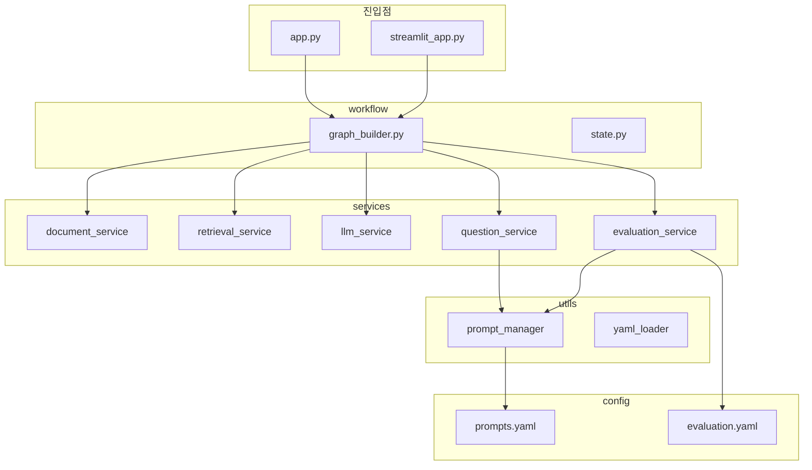
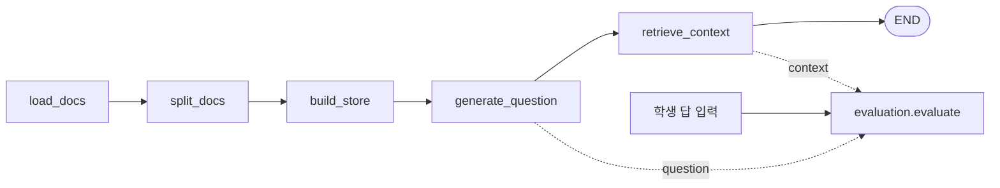

# PaperClinic

* PDF 문서를 읽어 질문을 만들고, 학생 답안을 문서 근거와 평가 기준으로 채점하는 실습용 프로젝트 
* LangGraph 사용

## 실행

```bash
python -m venv .venv
.venv\Scripts\activate   # Windows
pip install -r requirements.txt
```

- CLI: `python app.py <파일.pdf> -a "학생 답안"`
- UI: `streamlit run streamlit_app.py`

## 코드 구성



## LangGraph 흐름과 평가



`WorkflowBuilder.evaluation`으로 질문·근거·학생 답을 넘겨 평가

## 환경 변수 `.env`


| 변수 | 필수 | 설명 |
|------|------|------|
| `OPENAI_API_KEY` | 예 | 임베딩용 **OpenAI 공식 API** 키 |
| `FACTCHAT_API_KEY` | 예 | 채팅용 키 (임베딩 키와 별도) |
| `FACTCHAT_BASE_URL` | 예 | FactChat 등 OpenAI SDK 호환 엔드포인트 베이스 URL (예: `https://.../v1`) |
| `FACTCHAT_MODEL` | 예 | 해당 엔드포인트에서 쓸 모델 이름 |
| `LANGCHAIN_TRACING_V2` | 아니오 | `true`로 두면 LangSmith 추적 |
| `LANGCHAIN_API_KEY` | 아니오 | LangSmith API 키 |
| `LANGCHAIN_PROJECT` | 아니오 | LangSmith 프로젝트 이름 |

